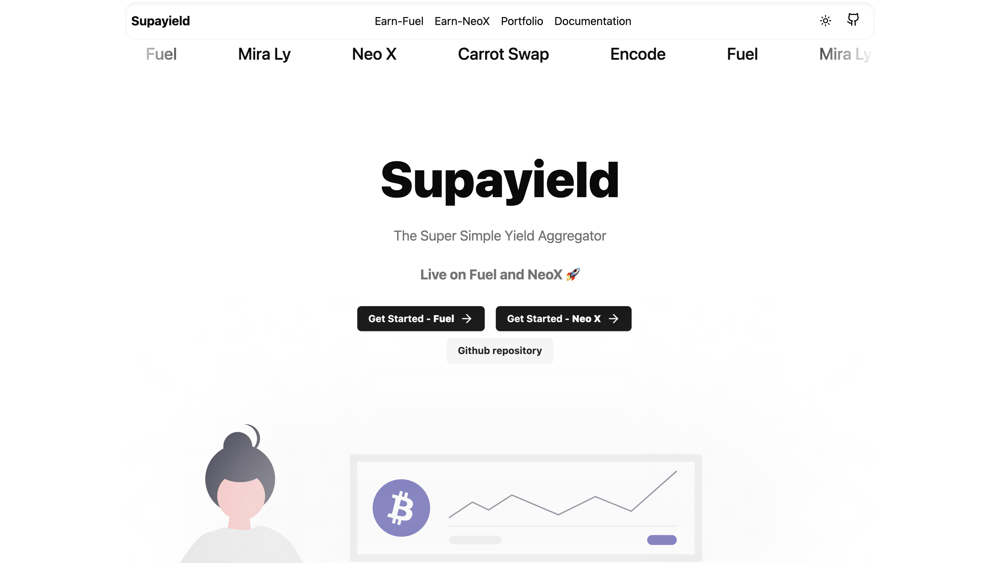

# SupaYield

Demo : [supayield](https://supayield.vercel.app)

## Why ?

SupaYield is a super simple yield aggregator designed to aggregate opportunities from new ecosystems like FUEL and Neo-X.

## What ?

The user can deposit asset and get $SUPA token as a LP Token.

## How ?

In the background, we leverage different liquidity providers for different chains:

- On Fuel, we leverage liquidity pools from mira.ly
- On Neo-X, we leverage liquidity pools from carrot-fi

Our contract is based on ERC4626 standard and the SRC-6 Fuel standard, which is a standard for yield-bearing vaults.

## How to use ?

1. Go to https://supayield.vercel.app
2. Connect your wallet
3. Deposit your assets
4. Get your $SUPA token
5. Audit the transaction / contract

## License

GPL-3.0
